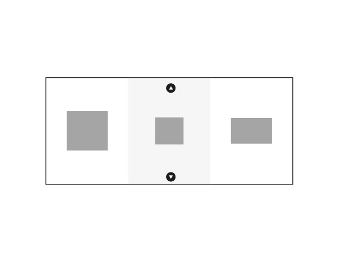
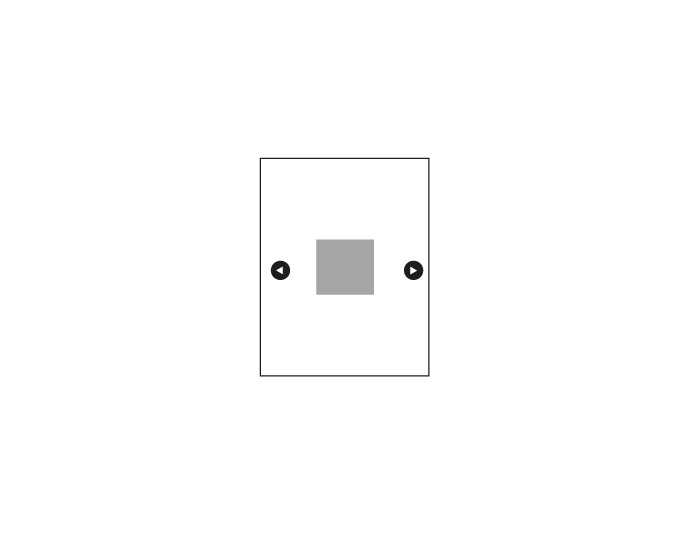

**Сверстайте фотогалерею со следующим поведением:**

1) При ширине экрана более 600px -- на одном экране помещается 3 фотографии, равно распределенных по горизонтали и отцентрированных по вертикали. Бэкграунд фотокарточек чередуется. Страница скроллится по вертикали.

2) При ширине экрана менее 600px -- на одном экране помещается 1 фотография, выровненная по центру по горизонтали и вертикали. Бэкграунд фотокарточек одинаковый. Страница скроллится по горизонтали.

**Дополнительно: (можно не делать)**

3) Добавьте на страницу кнопки прокрутки (вверх/вниз при ширине больше 600, вправо/влево при ширине меньше 600px), при нажатии на которые контент бы прокручивался к следующей/следующим карточкам. Навигация осуществляется только этими кнопками (скролла нет). При отключенном js поведение возвращается на базовое (со скроллом).

Пример работы можно посмотреть в [видео-файле](./layout/working_sample.webm) (во второй части видео показана работа с выключенным js). Картинки и иконки для кнопок можно взять в папке `assets`, или использовать свои.
